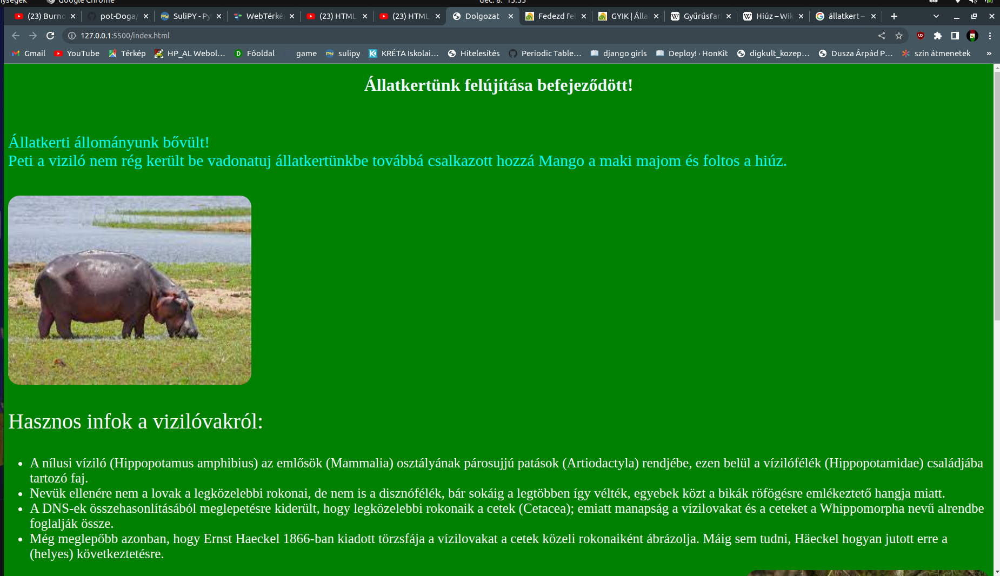
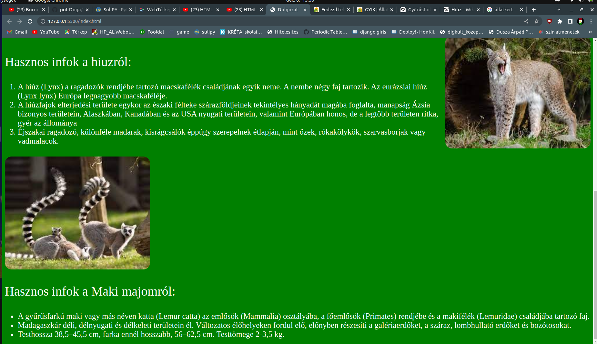

# Pot-Dolgozat - Állatkert

# Így kell kinéznie a kèsz weboldalnak ahogy a kinezet1.png és a kinezet2.png-ben lehet látni.

Feladatok:

1. A a weboldal kódolása UTF-8 -as legyen továbbá weboldal nyelve magyar (hu) legyen!

2. A kis fülecske (baloldalt legfelül) neve Dolgozat legyen!

3. Az "*Állatkertünk felújítása befejeződött!*" szövegrész legyen fehér szinű, középre helyezve és 1. cimsorba rakva!

4. Illeszen be 1 sortörést a 1. cimsor után!

5. Hozzon létre egy (p) paragrafust amiben rakja bele a "Állatkerti állományunk bővült!" szövegett amit formázzon át 20px-re és szinként adja meg az "aqua"-t ! Ezután rakjon e szöveg mőgé egy sortörést!

6. Hozzon létre mégegy (p) paragrafust amiben rakja bele az állatok beceneveinek szövegrészét amit formázzon át 20px-re és szinként adja meg az "*aqua*"-t! 

7. A "*Hasznos infok állatnév...*" szövegek legyenek fehérek és 40px nagyságúak!

8. A háttér legyen zöld!

9. A lista elemek felsorolása legyen fehér szinű és 21px-es!

10/A. Szurjon be 3 képet a mintának megfeleően mind a három kép rendelkezzen ezekkel a formázásokkal:

10/B. Minden kép után tegyen egy sortörést!

10/C. ha rávisszük bármelyik képre az egeret írja ki, hogy "*Állatfotó*"!

10/D. Továbbá minden kép legyen 21px -sen lekerekitve!

10/E. A mind a három kèp legyen 350px magas és 450 px széles!

10/F. Csak a hiuzos képet tolja jobbra a többi kép maradjon alapértelmezett baloldalon!

10/H. Összes kèp alternatív szövege legyen "*Állatfotó*"! (Ha nem jelenik meg a kèp akkor az alt legyen "*Állatfotó*")

9. A vizilónál és a maki majom résznél legyen számozatlan felsorolás de a hiúznál legyen számozott felsorolás (A mintának megfelelően)!

# A dolgozatra 50 perc áll rendelkezésre kizárólag vscode-ot ès a w3school oldalát lehet használni! Bármilyen más weboldal, vagy kommunikációs platform használata esetén jegy levonás történik!

# A kèsz munkákat mindenki töltse fel egy github repositoryiba saját nevèvel ellátva!

# jó munkát kivánok! 

